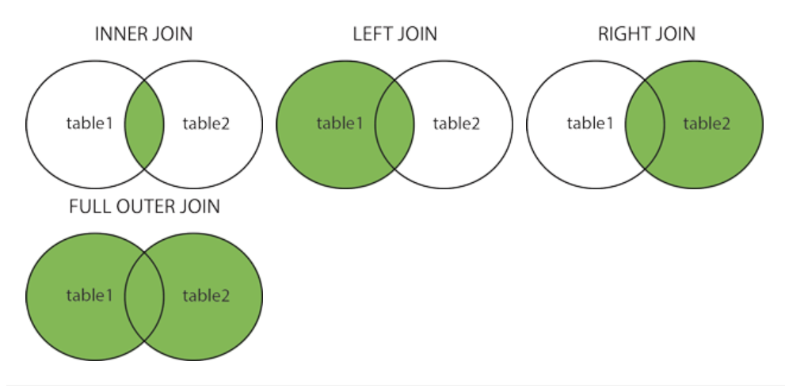

# TỰ HỌC SQL

[I. SQL SELECT](#i-sql-select)

[II. SQL WHERE, AND, OR, NOT](#ii-sql-where-and-or-not)

[III. SQL ORDER BY](#iii-sql-order-by)

[IV. UPDATE](#iv-update)

[V. DELETE](#v-delete)

[VI. SELECT TOP](#vi-select-top)

[VII. SELECT MIN, MAX](#vii-select-min-max)

[VIII. COUNT(), AVG(), SUM() Functions](#viii-count-avg-sum-functions)

[IX. LIKE](#ix-like)

[X. Wildcards](#x-wildcards)

[XI. IN](#xi-in)

[XII. BETWEEN](#xii-between)

[XIII. Aliases](#xiii-aliases)

[XIV. SQL Joins](#xiv-sql-joins)

[XV.Self Join](#xv-self-join)

[XVI. SLQ UNION](#xvi-sql-union)

[XVII. GROUP BY](#xvii-group-by)

[XVIII. HAVING Clause](#xviii-having-clause)

[XIX. EXISTS](#xix-exists)

## I. SQL SELECT

`SELECT` dùng để select data từ database.

Kết quả trả về dưới dạng bảng, gọi là result-set

**Syntax:**

```SQL
    SELECT column1, column2...
    FROM table_name;
```

Trong đó, `column1, column2` là các trường (**field**) được select từ `table_name`. Nếu muốn lấy tất cả các trường sử dụng:

```SQL
    SELECT * FROM table_name;
```

Nếu mong muốn các giá trị trong trường được select ra không có giá trị nào bị lặp lại ta dùng:

```SQL
    SELECT DISTINCT _tentruong FROM _ten_table
```

Và

```SQL
    SELECT COUNT (DISTINCT _tentruong) FROM _ten_table
```

Để xuất ra số giá trị khác nhau trong trường được chọn

**Note: SELECT DISTINCT không dùng được với MS Access database, để dùng ta có ví dụ:**

```SQL
    SELECT Count(*) AS DistinctCountries
    FROM (SELECT DISTINCT Country FROM Customers);

```

## II. SQL WHERE, AND, OR, NOT

`WHERE` được dùng như điều kiện lọc các record được chọn ra.

**Syntax:**

```SQL
    SELECT column1, column2, ...
    WHERE condition;
    FROM table_name
```

Khi thực hiện lệnh, chỉ có các record thỏa mãn `condition` mới được select ra.

Sử dụng kết hợp `AND, OR, NOT` với `WHERE` với:

- `AND` đồng thời xảy ra (logic and)
- `OR` ít nhất một xảy ra(logic OR)
- `NOT` phủ định

**Ví dụ:**

```SQL
    SELECT * FROM Customers
    WHERE Country='Germany' AND CustomerId >=2;
```

Chọn ra các record có đồng thời `Country` là `Germany` và có `CustomerId` lớn hơn hoặc bằng 2.

Chú ý các trường với giá trị `numeric` không nên có ngoặc đơn `''`.

Operator | Description
---------|------------
`=` | Equal
`>` | Greater than |
`<` | Less than |
`>=` | Greater than or equal |
`<=` | Less than or equal |
`<>` | Not equal. Note: In some versions of SQL this operator may be written as != |
`BETWEEN` | Between a certain range |
`LIKE` | Search for a pattern |
`IN` | To specify multiple possible values for a column

## III. SQL ORDER BY

Dùng `ORDER BY` để in ra record theo thứ tự:

- `ASC`: Sắp xếp tăng dần (default)
- `DESC`: Sắp xếp giảm dần.

**Syntax:**

```SQL
    SELECT * FROM Customers
    ORDER BY field_1, field_2 ASC|DESC;
```

nếu không thêm `ASC` hoặc `DESC` sẽ default là `ASC`, khi để `field_1`, `field_2` tức là ta sẽ sắp xếp theo thứ tự với `field_1` trước, đối với 2 record có cùng `field_1` sẽ thực hiện sắp xếp theo `field_2`.

**Ví dụ:**

Sắp xếp theo nhiều trường.

```SQL
    SELECT * FROM Customers
    ORDER BY Country, CustomerName;
```

Sắp xếp theo thứ tự _tăng dần_ của trường Country, nếu 2 record có cùng trường Country thì sắp xếp theo thứ tự _giảm dần_ của trường **CustumerName**

```SQL
    SELECT * FROM Customers
    ORDER BY Country ASC, CustomerName DESC;
```

## III. INSERT INTO Statement

`INSERT INTO` dùng để thêm dữ liệu vào database

Có 2 kiểu để thêm:

```SQL
    INSERT INTO table_name (column1, column2, column3, ...)
    VALUES (value1, value2, value3, ...);
```

Thêm record với giá trị tương ứng với trường mong muốn. Cách thêm này ta có thể thêm  1 record với các trường mà ta muốn có giá trị. Trường nào k được thêm sẽ có giá trị null.

**Ví dụ:**

```SQL
    INSERT INTO Customers (CustomerName, City, Country)
    VALUES ('Cardinal', 'Stavanger', 'Norway');
```

Kết quả:


Ta để ý thấy tuy ta không thêm giá trị cho trường CustomerID nhưng nó vẫn tự generate và tăng theo đúng quy tắc.

Hoặc có thể dùng

```SQL
    INSERT INTO table_name
    VALUES (value1, value2, value3, ...);
```

Để thêm record với tất cả các trường trong record đều có giá trị. Các giá trị của trường tương ứng theo thứ tự từ trái qua phải.

**Chú ý: Các trường không được thêm value khi hiển thị sẽ nhận giá trị NULL. Để kiếm tra giá trị của một trường trong record có phải NULL hay không. Ta sử dụng `IS NULL` hoặc `IS NOT NULL`**

**Syntax:**

```SQL
    SELECT column_names
    FROM table_name
    WHERE column_name IS NOT NULL;
```

hoặc

```SQL
    SELECT column_names
    FROM table_name
    WHERE column_name IS NULL;
```

## IV. UPDATE

Dùng để chỉnh sửa record đã có trong table

**Syntax:**

```SQL
    UPDATE table_name
    SET column1 = value1, column2 = value2, ...
    WHERE condition;
```

Dùng `WHERE` để chọn xem record nào cần update, nếu như k có `WHERE` tất cả các record trong table đều được update

**Ví dụ:**

```SQL
    UPDATE Customers
    SET ContactName = 'Alfred Schmidt', City= 'Frankfurt'
    WHERE CustomerID = 1;
```

Như vậy sẽ update trường `ContactName` và `City` của record có `CustomerID = 1`.

Có thể Update nhiều record một lúc, ví dụ ta để `WHERE City = 'Paris'` thì sẽ update tất cả các record có trường `City = 'Paris'`.

## V. DELETE

Dùng để xóa record khỏi table

**Syntax:**

```SQL
    DELETE FROM table_name WHERE condition;
```

Nếu như bỏ qua `WHERE` sẽ xóa tất cả record khỏi table mà không xóa table

## VI. SELECT TOP

`SELECT TOP` dùng để specify số lượng records sẽ lấy ra.

Khôn phải tất cả databases đều support `SELECT TOP`

**SQL server / MS Access Syntax:**

```SQL
    SELECT TOP number|percent column_name(s)
    FROM table_name
    WHERE condition;
```

**MySQL Syntax:**

```SQL
    SELECT column_name(s)
    FROM table_name
    WHERE condition
    LIMIT number;
```

**Oracle 12 Syntax:**

```SQL
    SELECT column_name(s)
    FROM table_name
    ORDER BY column_name(s)
    FETCH FIRST number ROWS ONLY;
```

**Older Oracle Syntax (with ORDER BY):**

```SQL
    SELECT *
    FROM (SELECT column_name(s) FROM table_name ORDER   BY column_name(s))
    WHERE ROWNUM <= number;
```

**Ví dụ:**

```SQL
    SELECT TOP 3 * FROM Customers;
```

Lấy ra 3 record đầu tiên từ Customers

Với MySQL

```SQL
    SELECT * FROM Customers;
    LIMIT 3;
```

`SELECT TOP` bằng percent với SQL Server/MS Access

```SQL
    SELECT TOP 50 PERCENT * FROM Customers;
```

Chọn ra 1/2 số bản ghi đầu tiên của table

Với Oracle

```SQL
    SELECT * FROM Customers
    FETCH FIRST 50 PERCENT ROWS ONLY;
```

Ví dụ kết hợp với `WHERE`

```SQL
    SELECT TOP 3 * FROM Customers
    WHERE Country = 'Viet Nam'
```

Chọn ra 3 bản ghi đầu tiên có trường `Country = Viet Nam`

## VII. SELECT MIN, MAX

`MIN(), MAX()` dùng để lấy ra giá trị nhỏ nhất trong trường được chọn.

**Syntax:**

```SQL
    SELECT MIN|MAX(column_name)
    FROM table_name
    WHERE condition;
```

**Ví dụ:**

```SQL
    SELECT MAX(Price) AS LargestPrice
    FROM Products;
```

Lấy ra giá trị lớn nhất của trường `Price` và sau đó gán cho `LargestPrice` rồi hiển thị ra.

## VIII. COUNT(), AVG(), SUM() Functions

- `COUNT()` trả về số record match với điều kiện.
- `SUM()` trả về tổng giá trị của record ứng với trường

- `AVG()` trả về trung bình cộng giá trị của record ứng với trường.

**Syntax:**

```SQL
    SELECT COUNT|SUM|AVG(column_name)
    FROM table_name
    WHERE condition;
```

Ví dụ:

```SQL
    SELECT COUNT(ProductID)
    FROM Products;
```

Đếm số record có giá trị `ProductID` khác `NULL`

```SQL
    SELECT AVG|SUM(Price)
    FROM Products;
```

Tính giá trị trung bình hoặc tổng trong trường `Price`, bỏ qua các giá trị NULL.

## IX. LIKE

Sử dụng `LIKE` kết hợp với `WHERE` để lọc dữ liệu.

`LIKE` thường đi với các operator:

- `%` để diễn tả thành phần của dữ liệu
- `_` để biểu diễn cho 1 kí tự, do đó `__` là 2 kí tự...

**Chú ý: MS Access sử dụng `*` thay cho `%` và `?` thay cho `_`**

**`LIKE` Syntax:**

```SQL
    SELECT column1, column2, ...
    FROM table_name
    WHERE columnn LIKE pattern;
```

Cách sử dụng LIKE với các operator:

LIKE Operator | Description
--------------|------------
WHERE CustomerName LIKE 'a%' | Tìm record có giá trị trong trường bắt đầu bằng kí tự `a`
WHERE CustomerName LIKE '%a' | Tìm record có giá trị trong trường kết thúc bằng kí tự `a`
WHERE CustomerName LIKE '%or%' | Tìm các record mà trường có giá trị chứa `or`
WHERE CustomerName LIKE '_r%' | Tìm các record mà trường có giá trị chứa `r` ở vị trí thứ 2
WHERE CustomerName LIKE 'a_%' | Tìm các record mà trường có giá trị bắt đầu bằng `a` và có ít nhất 2 kí tự
WHERE CustomerName LIKE 'a__%' | Tìm các record mà trường có giá trị bắt đầu bằng `a` và có ít nhất 3 kí tự
WHERE ContactName LIKE 'a%o' | Tìm các record có giá trị trường bắt đầu bằng `a` và kết thúc bằng `o`

## X. Wildcards

Là các operator đi cùng với `LIKE`

**Wildcards characters trong MS Access:**
Symbol | Description | Example
-------|-------------|--------
`*` | Represents zero or more characters | bl* finds bl, black, blue, and blob
`?` | Represents a single character | h?t finds hot, hat, and hit
`[]` | Represents any single character within the brackets | h[oa]t finds hot and hat, but not hit
`!` | Represents any character not in the brackets | h[!oa]t finds hit, but not hot and hat
`-` | Represents any single character within the specified range | c[a-b]t finds cat and cbt
`#` | Represents any single numeric character | 2#5 finds 205, 215, 225, 235, 245, 255, 265, 275, 285, and 295

**Wildcards characters trong SQL Server:**

Symbol | Description | Example
-------|-------------|--------
`%` | Represents zero or more characters | bl% finds bl, black, blue, and blob
`_` | Represents a single character | h_t finds hot, hat, and hit
`[]` | Represents any single character within the brackets | h[oa]t finds hot and hat, but not hit
`^` | Represents any character not in the brackets | h[^oa]t finds hit, but not hot and hat
`-`| Represents any single character within the specified range | c[a-b]t finds cat and cbt

## XI. IN

`IN` cho phép ta chọn nhiều giá trị trong `WHERE`, nói cách khác nó như là short hand của `OR`

**Syntax:**

```SQl
    SELECT column_name(s)
    FROM table_name
    WHERE column_name IN (value1, value2, ...);
```

hoặc

```SQL
    SELECT column_name(s)
    FROM table_name
    WHERE column_name IN (SELECT STATEMENT);
```

**Ví dụ:**

```SQL
    SELECT * FROM Customers
    WHERE Country IN|NOT IN ('Germany', 'France', 'UK');
```

Chọn ra các record có trường `Country` có giá trị( hoặc ngoài các giá trị) `Germany hoặc France, hoặc UK`.

```SQL
    SELECT * FROM Customers
    WHERE Country IN (SELECT Country FROM Suppliers);
```

Chọn ra các record từ `Customers` table có trường `Country` có các giá trị mà trường `Country` trong `Suppliers` table có.

## XII. BETWEEN

`BETWEEN` + `AND` để chọn ra các record có giá trị trường nằm trong một khoảng nào đó, bao gồm kiểu `numbers`, `text`, `date`

**Syntax:**

```SQL
    SELECT column_name(s)
    FROM table_name
    WHERE column_name BETWEEN value1 AND value2;
```

**Ví dụ:**

```SQL
    SELECT * FROM Products
    WHERE Price NOT BETWEEN 10 AND 20;
```

```SQL
    SELECT * FROM Products
    WHERE ProductName BETWEEN 'Carnarvon Tigers' AND 'Mozzarella di Giovanni'
    ORDER BY ProductName;
```

Sẽ chọn ra các record có `ProductName` nằm trong khoảng từ `Carnarvon Tigers` đến `Mozzarella di Giovanni` theo thứ tự Alphabet rồi sau đó hiển thị ra theo thứ tự Alphabet luôn

```SQL
    SELECT * FROM Products
    WHERE ProductName NOT BETWEEN 'Carnarvon Tigers' AND 'Mozzarella di Giovanni'
    ORDER BY ProductName;
```

Như ví dụ trên nhưng là chọn ngoài khoảng.

**Ví dụ với Date:**

```SQL
    SELECT * FROM Orders
    WHERE OrderDate BETWEEN #07/01/1996# AND #07/31/1996#;
```

hoặc

```SQL
    SELECT * FROM Orders
    WHERE OrderDate BETWEEN '1996-07-01' AND '1996-07-31';
```

## XIII. Aliases

SQL Aliases dùng để hiển thị ra table, column với một cái tên nhất thời khác (Chỉ tồn tại trong khoảng thời gian sử dụng, không làm thay đổi tên ban đầu).

Aliases được sử dụng với `AS` keyword

**Aliases column Syntax:**

```SQL
    SELECT ten_cot AS alias_name
    FROM ten_table;
```

**Aliases table Syntax:**

```SQL
    SELECT ten_cot(s)
    FROM ten_table AS alias_name;
```

**Ví dụ 1:**

```SQL
    SELECT CustomerName AS Customer, ContactName AS [Contact Person]
    FROM Customers;
```

Lấy ra 2 trường `CustomerName` và `ContactName` từ bảng `Customers` và hiển thị dưới các tên lần lượt `Customer` và `Contact Person`.

**Chú ý: Đối với tên trường có dấu cách thì cần phải đưa vào trong dấu "" hoặc [].**

**Ví dụ 2:**

```SQL
    SELECT CustomerName, Address + ', ' + PostalCode + ' ' + City + ', ' + Country AS Address
    FROM Customers;

```

Với bảng:


Kết quả:


Ta thấy kết quả là chọn ra trường `CustomerName`.

Chọn ra các trường `Address`, `PostalCode`, `City`, `Country` và gộp chúng lại rồi hiển thị ra theo cú pháp `address, postalcode city, country` trong trường mới gọi là `Address`.

Đối với `MYSQL` thì câu lệnh trên như sau:

```SQL
    SELECT CustomerName, CONCAT(Address,', ',PostalCode,', ',City,', ',Country) AS Address
    FROM Customers;
```

**Ví dụ sử dụng Aliaes với bảng:**

```SQL
    SELECT o.OrderID, o.OrderDate, c.CustomerName
    FROM Customers AS c, Orders AS o
    WHERE c.CustomerName='Around the Horn' AND c.CustomerID=o.CustomerID;
```

Giải thích: Ta dùng Alias với 2 bảng `Customers` và `Orders`.

Khi đó `Customers` được sử dụng với tên thay thế là `c`

`Orders` được sử dụng với tên thay thế là `o`.

Câu lệnh sẽ chọn ra:

- `OrderID` và `OrderDate` từ bảng `o` hay bảng `Orders`

- `CustomerName` từ bảng `c` hay bảng `Customers`

Với điều kiện đồng thời là `CustomerName` có giá trị là `Around the Horn` và `c.CustomerID = o.CustomerID`.

Các câu lệnh trên sẽ tương đương khi không sử dụng `Aliases`:

```SQL
    SELECT Orders.OrderID, Orders.OrderDate, Customers.CustomerName
    FROM Customers, Orders
    WHERE Customers.CustomerName='Around the Horn' AND Customers.CustomerID=Orders.CustomerID;

```

**Nhận xét:**

Aliases sẽ hữu dụng trong các trường hợp:

- Có nhiều hơn 1 bảng cùng tham gia 1 dòng lệnh

- Tên các cột và bảng quá dài, khó đọc

- Có nhiều cột cùng gộp lại

## XIV. SQL Joins

Thường dùng để combine các bản ghi từ 2 hoặc nhiều table, dựa trên các column có quan hệ liên quan đến nhau từ các bảng.

Ví dụ cho 2 bảng:


Ta thấy 2 bảng có trường CustomerID chung, có thể hai bảng sẽ có chung các giá trị ở 2 trường này và có quan hệ gì đó. Trong trường hợp muốn ghép, ta thực hiện như sau:

```SQL
    SELECT Orders.OrderID, Customers.CustomerName, Orders.OrderDate
    FROM Orders
    INNER JOIN Customers ON Orders.CustomerID=Customers.CustomerID;
```

Câu lệnh trên thực hiện chọn ra các trường `OrderID`, `OrderDate` từ bảng `Orders` và trường `CustomerName` từ bảng `Customers`

Kết quả được như sau:


Nhận xét kết quả trên giống với dòng lệnh sau:

```SQL
    SELECT Orders.OrderID, Customers.CustomerName, Orders.OrderDate
    FROM Orders,CustomerName
    WHERE Orders.CustomerID=Customers.CustomerID;
```

**Ta rút ra các loại JOINS trong SQL:**

- `JOIN`: **inner** - trả về các record từ hai bảng có chung value nào đó

- `LEFT JOIN`: **outer**- trả về tất cả các record từ bảng trái và các record chung của hai bảng.

- `RIGHT JOIN`: **outer**- trả về tất cả các record từ bảng phải và các record chung của hai bảng.

- `FULL JOIN`: **outer**- trả về tất cả các record từ hai bảng, trong đó các record chung không bị lặp lại.



**Ví dụ đối với 3 bảng:**

```SQL
    SELECT Orders.OrderID, Customers.CustomerName, Shippers.ShipperName
    FROM ((Orders
    INNER JOIN Customers ON Orders.CustomerID = Customers.CustomerID)
    INNER JOIN Shippers ON Orders.ShipperID = Shippers.ShipperID);
```

Câu lệnh trên như sau:

Lấy ra các trường `Orders.OrderID, Customers.CustomerName, Shippers.ShipperName` từ 3 bảng `Orders`, `Customers`, `Shippers` với statement là:

- Đầu tiên chọn ra từ `Orders` và `Customers` các record matched điều kiện `Orders.CustomerID = Customers.CustomerID`

- Sau khi có được kết quả lần 1 thì tiếp tục thực hiện lấy ra các record từ lần 1 matched `Orders.ShipperID = Shippers.ShipperID`.

Nếu như không có matched record nào thì kết quả trả về sẽ là bảng trống.

**Nhận xét:**

Cú pháp thực hiện đối với các type `JOINS` thì giống nhau.

**Syntax:**

```SQL
    SELECT column_name(s)
    FROM table1
    INNER JOIN/LEFT JOIN/RIGHT JOIN table2
    ON table1.column_name = table2.column_name,..statement;
```

### đối với FULL OUTER JOIN

`FULL OUTER JOIN` và `FULL JOIN` giống nhau

**Syntax:**

```SQL
    SELECT column_name(s)
    FROM table1
    FULL OUTER JOIN/ FULL JOIN table2
    ON table1.column_name = table2.column_name
    WHERE condition;
```

Nói tóm lại dù có record nào matched điều kiện hay không thì `FULL JOIN` vẫn trả về tất cả các record từ các bảng. Và nếu có matched thì các giá trị matched sẽ không bị lặp lại.

## XV.Self Join

Self join là kiểu select bình thường nhưng table tự join với chính nó, không dùng `JOIN`.

**Syntax:**

```SQL
    SELECT column_name(s)
    FROM table1 T1, table1 T2
    WHERE condition;
```

Với `T1` và `T2` là hai aliases khác nhau cùng cùng 1 table.

**Ví dụ:**

```SQL
    SELECT A.CustomerName AS CustomerName1, B.CustomerName AS CustomerName2, A.City
    FROM Customers A, Customers B
    WHERE A.CustomerID <> B.CustomerID
    AND A.City = B.City
    ORDER BY A.City;
```

Câu lệnh trên sẽ trả về các trường `CustomerName` và `City` trong bảng với điều kiện là chúng khác nhau về `CustomerID` và giống nhau về `City`.Show bảng kết quả theo thứ tự Alphabet của `City`.

## XVI. SLQ UNION

`UNION` operator dùng để kết hợp các câu lệnh `SELECT`. Với điều kiện là:

- Tất cả các `SELECT` statement được nối bằng `UNION` phải có cùng số column chọn ra.

- Các cột chọn ra phải có cùng loại data.

- các cột trong mọi `SELECT` phải có cùng order.

**Syntax:**

```SQL
    SELECT column_name(s) FROM table1
    UNION
    SELECT column_name(s) FROM table2;
```

Với `UNION`, các giá trị được trả về là các giá trị khác nhau. Để trả về các giá trị cho phép được lặp lại ta dùng `UNION ALL`

```SQL
    SELECT column_name(s) FROM table1
    UNION ALL
    SELECT column_name(s) FROM table2;
```

**Chú ý: Các column_name(s) trong các SELECT statement phải giống nhau và giống với column_name(s) trong dòng SELECT đầu tiên**.

**Ví dụ:**

**Ta không thể dùng cú pháp như sau:**

```SQL
    SELECT City FROM Suppliers, Customers
    ORDER BY City;
```

Thay vào đó, ta phải dùng `UNION`

```SQL
    SELECT City FROM Customers
    UNION
    SELECT City FROM Suppliers
    ORDER BY City;
```

Như vậy ta sẽ nhận được kết quả là các giá trị khác nhau của trường `City` từ hai bảng. Nếu muốn lấy tất cả(bao gồm cả các giá trị lặp lại) thì ta dùng `UNION ALL`.

**Ví dụ với WHERE:**

```SQL
    SELECT City, Country FROM Customers
    WHERE Country='Germany'
    UNION
    SELECT City, Country FROM Suppliers
    WHERE Country='Germany'
    ORDER BY City;
```

Chọn ra các giá trị từ 2 trường `City, Country` từ hai bảng với điều kiện là `Country` có giá trị là `Germany`.

Chú ý, nếu ta chỉ đặt `WHERE` ở một trong hai `SELECT`. Ví dụ:

```SQL
    SELECT City, Country FROM Customers
    UNION
    SELECT City, Country FROM Suppliers
    WHERE Country='Germany'
    ORDER BY City;
```

Thì giá trị trả về sẽ là giá trị 2 trường `City, Country` từ bảng `Customers` (tất cả giá trị) và các giá trị `City, Country` thỏa mãn điều kiện (`Country` = `Germany`) từ bảng `Suppliers`

Tương tự nếu như `WHERE` nằm ở `SELECT` đầu tiên

**Ví dụ khác:**

```SQL
    SELECT 'Customer' AS Type, ContactName, City, Country
    FROM Customers
    UNION
    SELECT 'Supplier', ContactName, City, Country
    FROM Suppliers;
```

Ta hiểu như sau. Dùng Aliases là `AS TYPE` để đặt tên tạm thời cho một cột khi hiển thị ra. Cụ thể ta sẽ được một cột là `TYPE` với giá trị là `Customer` đối với các record lấy ra từ bảng `Customers` và giá trị là `Supplier` đối với các record lấy ra từ bảng `Supplier`.


Kết quả trên đã thêm `WHERE` `Country="Canada"` để dễ nhận xét hơn.

## XVII. GROUP BY

`GROUP BY` statement được dùng để nhóm các record có cùng một value tại trường nào đó vào một nhóm.

`GROUP BY` thường đi cùng với các function( `COUNT()`, `MAX()`,`MIN()`, `SUM()`, `AVG()`).

**Syntax:**

```SQL
    SELECT column_name(s)
    FROM table_name
    WHERE condition
    GROUP BY column_name(s)
    ORDER BY column_name(s);
```

**Ví dụ:**

```SQL
    SELECT COUNT(CustomerID), Country
    FROM Customers
    GROUP BY Country
    ORDER BY COUNT(CustomerID) DESC;
```

Câu lệnh trên được hiểu như sau. Tìm ra các nhóm có cùng giá trị tại trường `Country` sau đó hiển thị ra số lượng các record trong một nhóm cùng với giá trị trương `Country` của nhóm. Dữ liệu hiển thị ra được sắp xếp theo thứ tự giảm dần số record trong nhóm.

**Kết quả:**


Ở ví dụ trên nếu ta để như sau:

```SQL
    SELECT CustomerID, Country
    FROM Customers
    GROUP BY Country
```

Kết quả in ra sẽ là tập hợp các phần tử đầu tiên xuất hiện của các nhóm và giá trị trường `Country` của nhóm.


Như ta thấy nhóm các phần tử có cùng giá trị trường `Country` là `Argentina` có phần tử đầu tiên với `CustomerID` là 12.

**Ví dụ:**

```SQL
    SELECT Shippers.ShipperName, COUNT(Orders.OrderID) AS NumberOfOrders FROM Orders
    LEFT JOIN Shippers ON Orders.ShipperID = Shippers.ShipperID
    GROUP BY ShipperName;
```

Các câu lệnh trên sẽ thực hiện như sau:

Lấy ra các bản ghi từ 2 bảng `Shippers` và `Orders` có cùng giá trị trường `ShipperID`. Sau đó `GROUP` các bản ghi theo trường `ShipperName`( tức là lấy ra các nhóm đơn hàng của cùng 1 shipper). Cuối cùng là đếm số đơn hàng trong một nhóm và hiển thị kết quả.

Vậy ta được bảng kết quả số đơn hàng mà mỗi shipper giao.


## XVIII. HAVING Clause

`HAVING` được sử dụng đi với `GROUP BY` vì khi ta sử dụng `GROUP BY` với các function thì `WHERE` không đi với các function được.

**Syntax:**

```SQL
    SELECT column_name(s)
    FROM table_name
    WHERE condition
    GROUP BY column_name(s)
    HAVING condition
    ORDER BY column_name(s);
```

**Ví dụ:**

```SQL
    SELECT COUNT(CustomerID), Country
    FROM Customers
    GROUP BY Country
    HAVING COUNT(CustomerID) > 5
    ORDER BY COUNT(CustomerID) DESC;
```

Vậy kết quả sẽ là bảng số lượng các customer có cùng `Country` với điều kiện số lượng này lớn hơn 5. Dữ liệu in ra sắp xếp theo thứ tự giảm dần.

**Note:** THử dùng aliases với trường `COUNT(CustomerID)`cũng không thể dùng `WHERE` được.

**Ví dụ:**

```SQL
    SELECT Employees.LastName, COUNT(Orders.OrderID) AS NumberOfOrders
    FROM Orders
    INNER JOIN Employees ON Orders.EmployeeID = Employees.EmployeeID
    WHERE LastName = 'Davolio' OR LastName = 'Fuller'
    GROUP BY LastName
    HAVING COUNT(Orders.OrderID) > 25;
```

Chọn ra các nhóm có cùng giá trị trường `LastName` từ hai bảng với điều kiện chỉ chọn ra các record có giá trị là `Davolio` và `Fuller` sau đó tách các nhóm này ra, đếm ố phần tử trong mỗi nhóm. Hiển thị ra nhóm có số phần tử lớn hơn 25.


## XIX. EXISTS

`EXISTS` operator được sử dụng để test xem có sự tồn tại( có kết quả thỏa mãn) một subquery hay không.

`EXISTS` sẽ trả về `TRUE` nếu như có kết quả trả về it nhất một record.

**Syntax:**

```SQL
    SELECT column_name(s)
    FROM table_name
    WHERE EXISTS
    (SELECT column_name FROM table_name WHERE condition);
```

Câu lệnh `SELECT` thứ 2 trong () chính là subquery.

**Ví dụ:**

```SQL
    SELECT SupplierName
    FROM Suppliers
    WHERE EXISTS (SELECT ProductName FROM Products WHERE Products.SupplierID = Suppliers.supplierID AND Price < 20);
```

Trong trường hợp câu lệnh trong () có trả về kết quả. `EXISTS` sẽ trả về `TRUE` và in ra cột `SupplierName` mà các giá trị trong bản ghi của nó thỏa mãn subquery.

Kết quả:


## XX. Any,All

